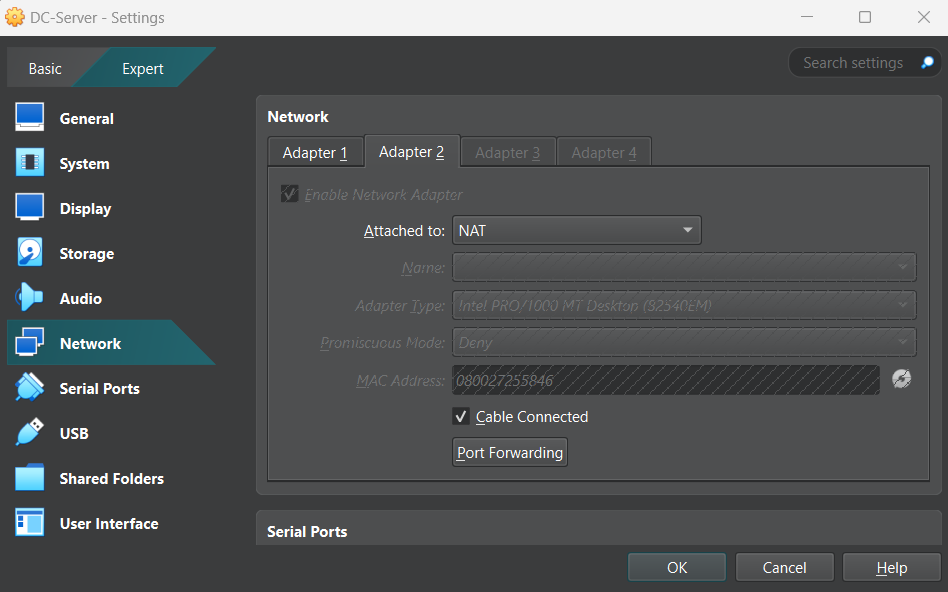
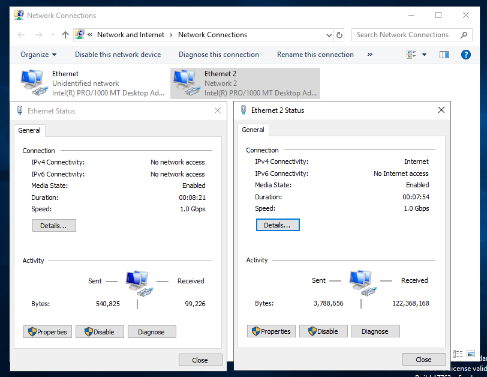
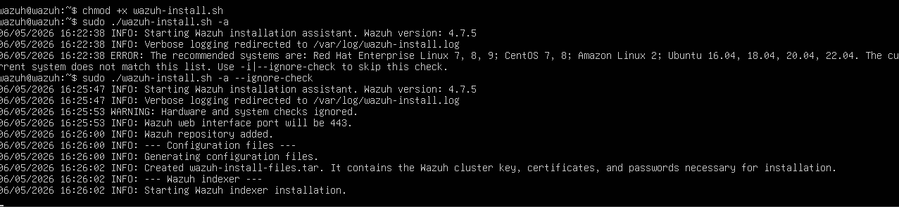
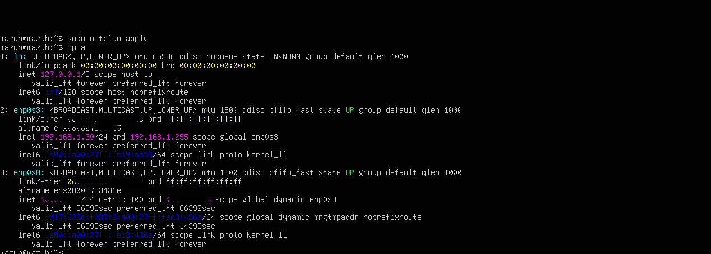
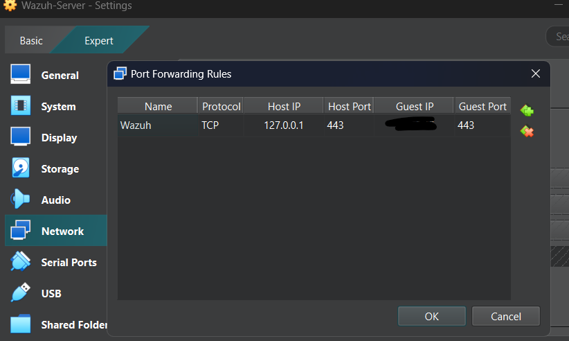
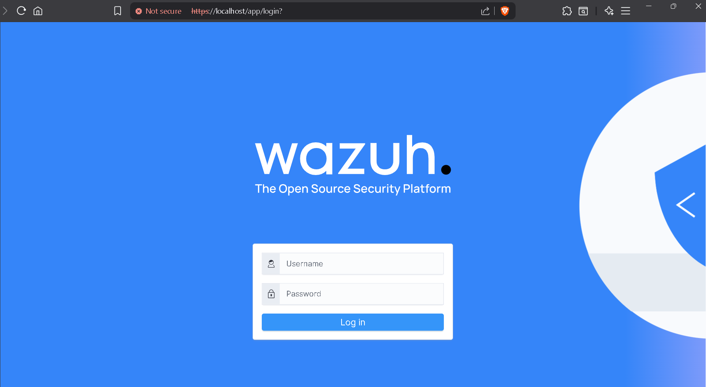

# SOC-Simulation-Lab

### 📌 Overview

This project documents the setup of a small Security Operations Center (SOC) simulation lab designed to monitor and analyze activity across a Windows Active Directory environment using Wazuh as the SIEM platform. The lab was built to gain hands-on experience with log collection, network segmentation, attack visibility, and security monitoring within a virtualized enterprise-style environment.

### 🎯 Objectives
- Simulate a basic SOC environment
- Collect and analyze security logs
- Monitor activity across multiple systems
- Understand how suspicious behavior appears in SIEM platforms
- Practice network segmentation and virtualization
- Gain exposure to security monitoring workflows

### 🛠 Technologies Used
| Technology     | Purpose                     |
| -------------- | --------------------------- |
| VirtualBox     | Virtualization              |
| Windows Server | Domain Controller           |
| Windows 10     | Client System               |
| Kali Linux     | Attack Simulation           |
| Ubuntu Server  | Wazuh Deployment            |
| Wazuh          | SIEM & Log Monitoring       |
| Netplan        | Linux Network Configuration |

### 🏗 Lab Architecture
                NAT / Internet
                      |
              ----------------
              |              |
            DC01         Wazuh Server
              |
          CLIENT01
              |
          Kali Linux

### 🌐 Network Design
Dual Network Configuration

Configured the domain controller with:

- Internal network adapter for lab communication
- NAT adapter for internet connectivity

This allowed:

- isolated internal communication
- controlled internet access
- separation between host and lab environment

### 🔐 Wazuh SIEM Deployment
Wazuh Installation

Deployed Wazuh on Ubuntu Server to function as the centralized monitoring platform for the SOC lab.

### Handling Compatibility Issues

During installation, OS compatibility restrictions were encountered.

Resolution
Verified Ubuntu version
Used:
`--ignore-check`

to bypass installer compatibility validation for homelab purposes.

### 🌍 Network Configuration for Wazuh Server
Static IP Configuration

Identified missing IP assignment on the lab network adapter and manually configured a static IP address using Netplan.

### Persistent Connectivity

Configured persistent network settings to ensure connectivity remained functional after system reboot.

Example technologies used:

Netplan
Ubuntu networking utilities

### 🔗 SIEM Dashboard Access
Port Forwarding Configuration

Because the internal lab network was isolated from the host system, NAT port forwarding was configured within VirtualBox to expose the Wazuh dashboard securely to the host machine.

This enabled:

- browser access via localhost
- dashboard management from host OS
- 

### 📊 Security Monitoring
Wazuh Dashboard Validation

Verified successful startup of:

- Wazuh Dashboard
- Wazuh Indexer
- Wazuh Manager

Confirmed SIEM accessibility and dashboard functionality.

### Configured persistent Wazuh services
- Enabled Wazuh manager, indexer and dashboard services
- Configured automatic startup on system boot
- Verified service persistence after reboot

